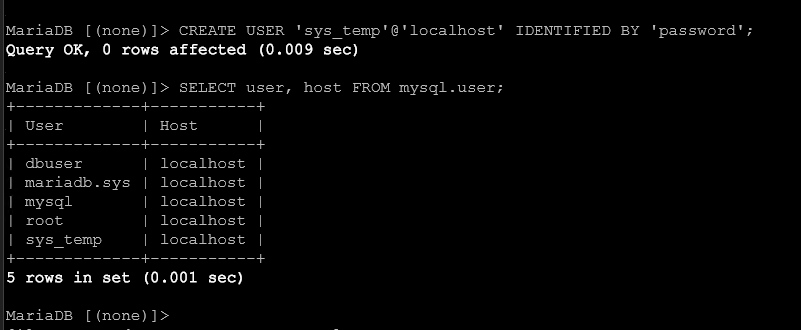
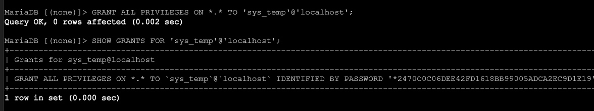
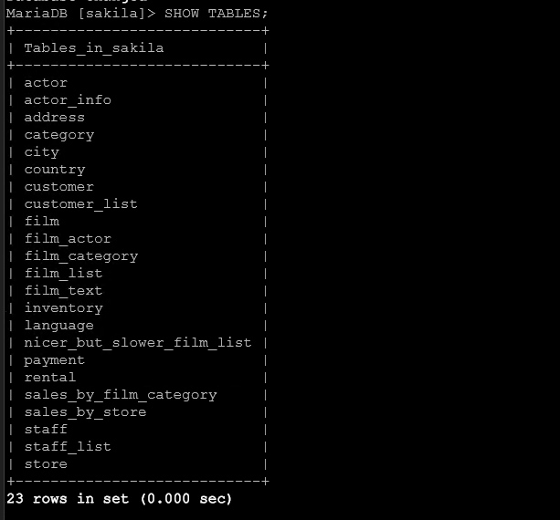

# Домашнее задание к занятию "`Работа с данными (DDL/DML)`" - `Милованов Константин`
[Домашнее задание](https://github.com/netology-code/sdb-homeworks/blob/main/12-02.md)


### Задание 1

1.1. Поднимите чистый инстанс MySQL версии 8.0+. Можно использовать локальный сервер или контейнер Docker.

1.2. Создайте учётную запись sys_temp.

1.3. Выполните запрос на получение списка пользователей в базе данных. (скриншот)

1.4. Дайте все права для пользователя sys_temp.

1.5. Выполните запрос на получение списка прав для пользователя sys_temp. (скриншот)

1.6. Переподключитесь к базе данных от имени sys_temp.

Для смены типа аутентификации с sha2 используйте запрос:

`ALTER USER 'sys_test'@'localhost' IDENTIFIED WITH mysql_native_password BY 'password';`

1.6. По ссылке https://downloads.mysql.com/docs/sakila-db.zip скачайте дамп базы данных.

1.7. Восстановите дамп в базу данных.

1.8. При работе в IDE сформируйте ER-диаграмму получившейся базы данных. При работе в командной строке используйте команду для получения всех таблиц базы данных. (скриншот)

Результатом работы должны быть скриншоты обозначенных заданий, а также простыня со всеми запросами.

### Решение

Список пользователей:



Список прав:




Список таблиц из командной строки:



Запросы и команды:
```
CREATE USER 'sys_temp'@'localhost' IDENTIFIED BY 'password';
GRANT ALL PRIVILEGES ON *.* TO 'sys_temp'@'localhost';
SHOW GRANTS FOR 'sys_temp'@'localhost';

mysql -u sys_temp -ppassword < ~/sqlbeg/sakila-db/sakila-schema.sql
mysql -u sys_temp -ppassword < ~/sqlbeg/sakila-db/sakila-data.sql

mysql -u sys_temp -ppassword
USE sakila;
SHOW TABLES;
```

---

### Задание 2


### Решение


Скрипт:
[Скрипт](./files/backup-home.sh)
